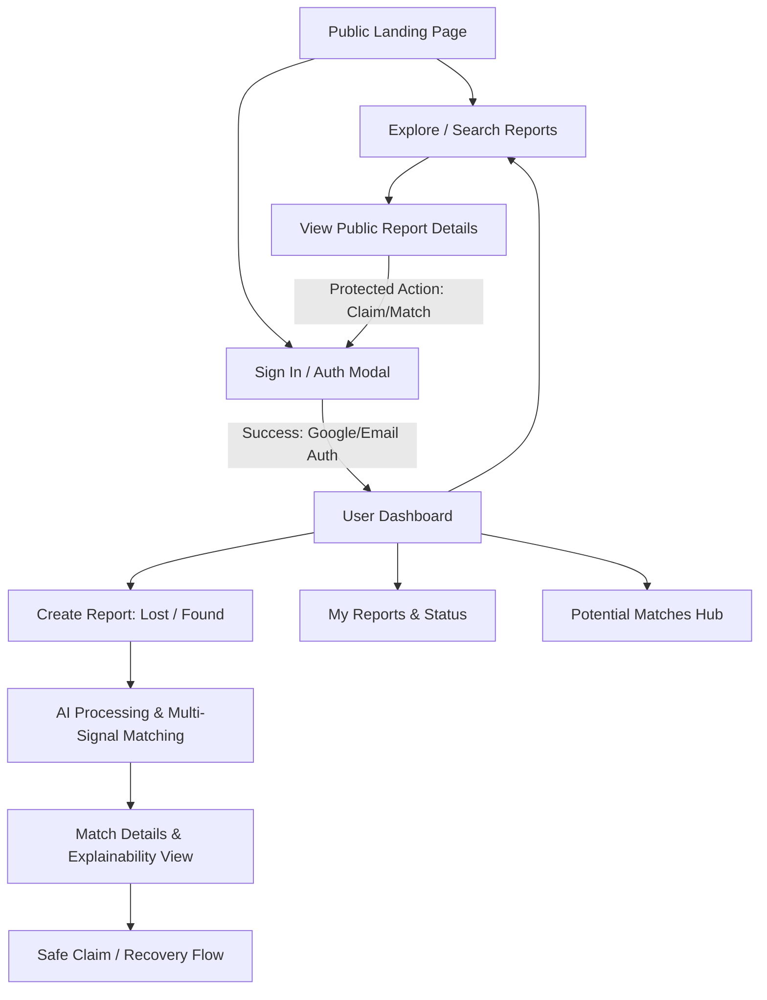
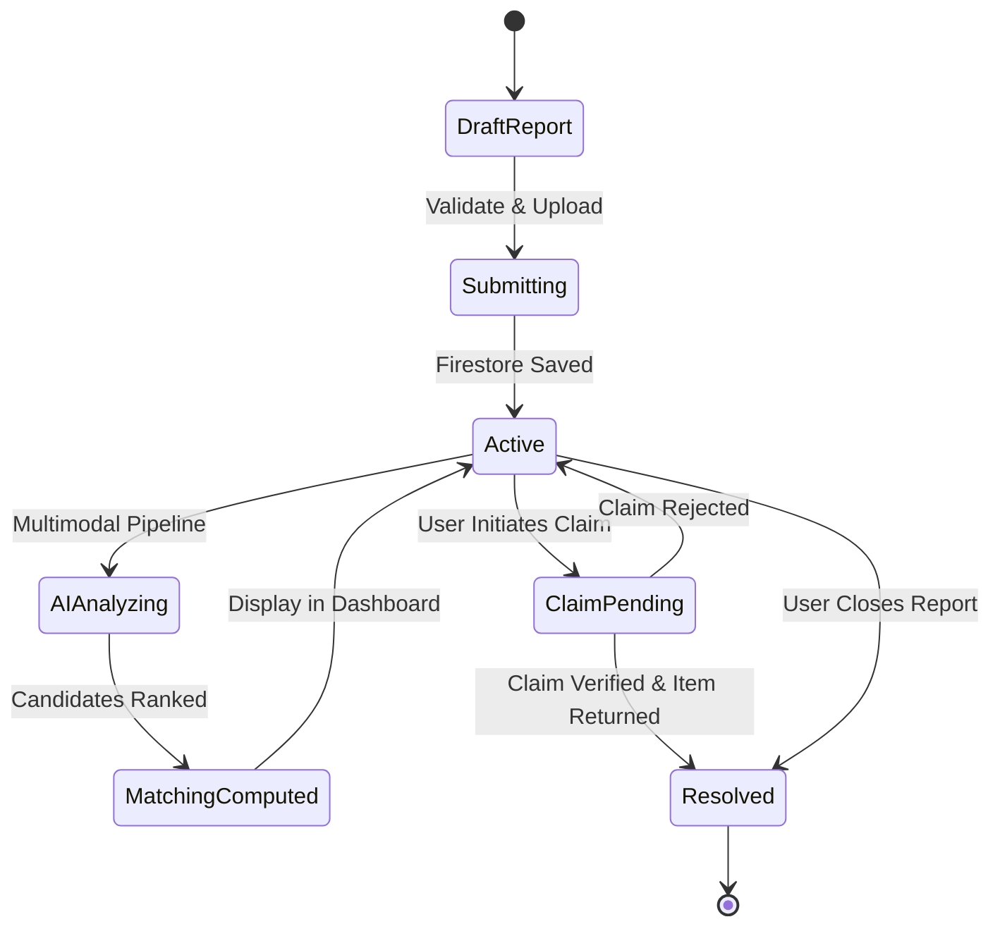

# Application Flow Document (APP_FLOW)

## CampusFind AI — Smart Campus Lost & Found

- **Document Version:** 1.0.0
- **Path:** `/docs/APP_FLOW.md`
- **Status:** Active Architectural Source of Truth

---

# 1. System Navigation & Architecture Map



---

# 2. Detailed User & Data Flows

## 2.1 Public Flow (Unauthenticated Visitor)
1. **Landing Page (`/`):**
   - Hero banner with clear value proposition and call-to-actions: *"Report Lost Item"*, *"Report Found Item"*, *"Explore Live Feed"*.
   - Live campus statistics (Total Items Recovered, Active Lost Reports, High-Confidence AI Matches).
   - Recent report cards preview.
2. **Explore Reports (`/reports`):**
   - Browse public lost and found reports.
   - Filter by status, category, location, and date.
3. **View Report Details (`/reports/[id]`):**
   - View public image, item title, general location, date, category, and report status.
   - Private contact details and direct claim actions prompt the user to **Sign In**.

---

## 2.2 Authentication Flow (`/login`)
```text
Landing Page / Protected Action Trigger
  ↓
Sign In Page / Modal
  ↓
Select Auth Provider (Google Sign-In / Email+Password)
  ↓
Firebase Auth SDK handles handshake
  ├── [Success] → Verify/create user profile in Firestore → Initialize session → Redirect to Dashboard or original deep-link
  └── [Failure] → Display accessible error toast / banner → Option to Retry or Recover Password
```

---

## 2.3 Report Submission Flow (`/report/lost` & `/report/found`)
```text
Dashboard or Nav Button
  ↓
Select Report Mode: [ LOST ITEM ] or [ FOUND ITEM ]
  ↓
Step 1: Upload Photo (Drag & Drop or File Picker)
  ├── Instant client preview
  ├── Client-side MIME validation (JPEG, PNG, WebP) & size check (<= 5MB)
  └── Optional: AI Instant Pre-tagger suggests Title/Category
  ↓
Step 2: Enter Core Metadata
  ├── Item Title (e.g., "Sony WH-1000XM4 Headphones")
  ├── Category (Electronics, ID/Cards, Keys, Bags, Bottles, Apparel, Books, Other)
  ├── Campus Location (Building/Zone picker + Specific Area notes)
  ├── Date & Time (Lost/Found timestamp)
  └── Detailed Description (Color, distinguishing marks, stickers, engravings)
  ↓
Step 3: Client Validation (Zod schema)
  ├── [Validation Error] → Inline accessible field errors & focus jump
  └── [Validation Passed] → Show loading overlay / submit state
  ↓
Step 4: Submission & Backend Execution
  ├── 1. Upload image to Firebase Storage (returns safe URL)
  ├── 2. Save document to Firestore `/reports/{reportId}` with status `ACTIVE`
  ├── 3. Trigger Gemini AI Multimodal analysis (extract structured JSON attributes)
  ├── 4. Update report document with `aiAttributes`
  ├── 5. Query candidate opposite reports & execute Multi-Signal Matching Engine
  └── 6. Save computed match records to `/matches`
  ↓
Redirect to Report Details Page with Live AI Match Breakdown
```

---

## 2.4 AI Matching & Verification Flow (`/reports/[id]`)
```text
Report Created / Viewed
  ↓
Fetch Precomputed Matches from `/api/reports/[id]/matches`
  ↓
Render Ranked Candidates List:
  ├── Match Score Badge (e.g., "94% Match" - Color-coded: Green >= 80%, Amber 50-79%, Gray < 50%)
  ├── Side-by-Side Comparison (Lost Image vs Found Image)
  ├── Signal Breakdown:
  │     • Visual Similarity: 92/100
  │     • Description Match: 89/100
  │     • Location Proximity: 97/100
  │     • Time Window Consistency: 91/100
  │     • Category Compatibility: 100/100
  └── Transparent Rationale ("Why this matches"):
        "Both reports describe a navy-blue backpack with a white laptop compartment.
         Found at Central Library within 2 hours of reported loss."
  ↓
User Action on Match:
  ├── [Not My Item / Dismiss] → Mark match as dismissed for user
  └── [This is My Item! / Claim] → Launch Safe Recovery / Claim Modal
```

---

## 2.5 Safe Contact & Recovery Flow (`Claim Modal`)
```text
Click "Claim Item" on Found Report
  ↓
Launch Accessible Claim Modal
  ↓
User provides Proof of Ownership:
  ├── Prompt: "Provide unique details not visible in photo (e.g. lock screen wallpaper, serial number, pouch contents)"
  └── Upload proof photo (optional, e.g. receipt or past photo of item)
  ↓
Submit Claim (`/api/claims`)
  ↓
Report status updates to `CLAIM_PENDING`
  ↓
Finder / Campus Security Desk receives Claim Notification
  ├── [Approved] → Contact info safely exchanged or Campus Security pickup point provided → Status: `RESOLVED`
  └── [Rejected] → Rationale given → Status reverts to `ACTIVE`
```

---

## 2.6 Search & Discovery Flow (`/reports`)
```text
Search Bar Input (Keywords or Natural Language: "Lost my blue water bottle near Gym")
  ↓
Debounced Query Dispatch
  ↓
Apply Facet Filters:
  ├── Type: [All] [Lost Only] [Found Only]
  ├── Category: [Electronics, Keys, IDs, ...]
  ├── Campus Zone: [North Campus, Science Block, Library, Student Union, ...]
  ├── Date Range: [Past 24h, Past Week, Past Month, Custom]
  └── Status: [Active, Resolved]
  ↓
Query Execution & Ranking:
  ├── Exact keyword & tag matches
  ├── Semantic score weighting
  └── Recency sorting
  ↓
Display Results Grid with Instant Hover Cards & Pagination (12 items/page)
```

---

## 2.7 Dashboard Flow (`/dashboard`)
```text
User Dashboard
  ├── Summary Stats (Active Lost, Active Found, Unread Match Alerts, Resolved)
  ├── Quick Actions:
  │     ├── [ + Report Lost Item ]
  │     ├── [ + Report Found Item ]
  │     └── [ Browse Reports ]
  ├── "My Reports" Tabs:
  │     ├── Active Reports (with match count badges)
  │     └── Resolved / Claimed History
  ├── "Top AI Matches for You" Carousel / Feed
  └── User Profile & Notification Settings
```

---

# 3. Comprehensive Edge States & UX Handling

| Edge State | System & UI Behavior |
| :--- | :--- |
| **Loading State** | Skeleton card loaders matching actual card geometry; spinner on action buttons with `aria-busy="true"`. |
| **Empty State (No Reports / No Matches)** | Descriptive illustration, encouraging headline (*"No matching items found yet"*), and clear CTA (*"We'll notify you as new found items are reported"* / *"Try broadening your search filters"*). |
| **Network Error / Offline** | Sticky alert banner: *"Unable to connect to campus servers. Retrying..."* with manual **[Retry]** button. Non-destructive form recovery using `localStorage`. |
| **Unauthorized Access** | Clean redirect to `/login` with `callbackUrl` parameter preserved so user returns immediately after signing in. |
| **Invalid Form Input** | Instant Zod client validation, red border highlight, accessible error message below the input (`aria-describedby`), and auto-scroll to first invalid input. |
| **Image Upload Failure** | Clear error message explaining the exact reason: *"File exceeds 5MB limit"* or *"Unsupported format. Please upload JPG, PNG, or WebP"*. Ability to replace image without losing filled form fields. |
| **AI Analysis Service Slow / Delayed** | Background queue UX: Report immediately saved; UI displays *"AI analysis in progress — matches will appear in a moment"* with a subtle pulsing radar badge. |
| **AI Extraction Partial / Fallback** | Graceful heuristic fallback: If Gemini analysis fails or times out, the system defaults to deterministic text/keyword matching and logs the failure without crashing the user flow. |
| **Zero Matches Discovered** | Honest state: *"0 potential matches found right now. Our AI will automatically evaluate new reports as they are submitted."* |

---

# 4. User Journey State Machine


