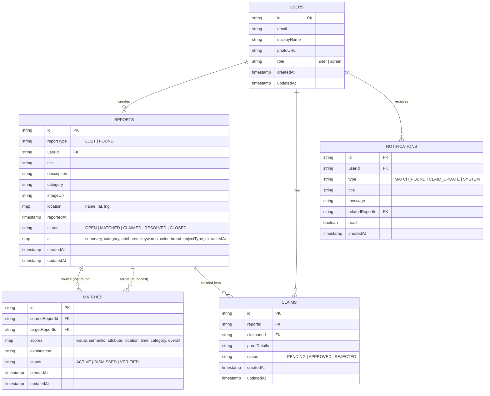

# Backend Database & Entity Schema

## CampusFind AI — Smart Campus Lost & Found

- **Document Version:** 1.0.0
- **Path:** `/docs/BACKEND_SCHEMA.md`
- **Status:** Active Architectural Source of Truth
- **Database Engine:** Firebase Cloud Firestore (with strong TypeScript types & Zod schema validation)

---

# 1. Entity Relationship Overview



---

# 2. Detailed Firestore Collection Schemas

## 2.1 Collection: `users`
Represents registered users in the application.

```typescript
export interface UserDocument {
  id: string;                    // Firebase Auth UID
  email: string;                 // User email
  displayName: string;           // Display name from Google/Email Auth
  photoURL?: string | null;      // Profile avatar URL
  role: 'user' | 'admin';        // Authorization role
  createdAt: string;             // ISO8601 string or Firestore Timestamp
  updatedAt: string;             // ISO8601 string or Firestore Timestamp
}
```

---

## 2.2 Collection: `reports`
Stores both Lost and Found submissions, their metadata, geolocation, and AI-extracted structured attributes.

```typescript
export type ReportType = 'LOST' | 'FOUND';

export type ReportStatus = 'OPEN' | 'MATCHED' | 'CLAIMED' | 'RESOLVED' | 'CLOSED';

export interface LocationData {
  name: string;                  // e.g. "Central Library, 2nd Floor Quiet Study"
  latitude?: number | null;      // Optional geo-coordinates
  longitude?: number | null;     // Optional geo-coordinates
  zone?: string | null;          // e.g. "North Campus", "Science Complex"
}

export interface AIRawAttributes {
  summary: string;               // AI semantic summary of visual + text features
  category: string;              // AI-normalized category
  attributes: string[];          // e.g. ["charging case", "white scratch on lid", "usb-c"]
  keywords: string[];            // e.g. ["earbuds", "sony", "audio", "case"]
  color: string;                 // Dominant color (e.g. "black", "navy blue")
  brand: string;                 // e.g. "Sony", "Apple", "Hydro Flask", "Unknown"
  objectType: string;            // e.g. "wireless earbuds", "water bottle", "backpack"
  extractedAt: string;           // Timestamp when Gemini completed extraction
}

export interface ReportDocument {
  id: string;                    // Unique Report UUID
  reportType: ReportType;        // 'LOST' | 'FOUND'
  userId: string;                // UID of report creator
  title: string;                 // e.g. "Black Sony Wireless Earbuds"
  description: string;           // User provided narrative description
  category: string;              // "electronics" | "bags" | "keys" | "cards" | "clothing" | "books" | "other"
  imageUrl?: string | null;      // Storage URL of uploaded photo
  location: LocationData;        // Campus location metadata
  reportedAt: string;            // Date & time the item was lost or found
  status: ReportStatus;          // Current lifecycle status
  ai?: AIRawAttributes | null;   // Structured attributes extracted by Gemini Vision
  createdAt: string;             // Record creation timestamp
  updatedAt: string;             // Last update timestamp
}
```

---

## 2.3 Collection: `matches`
Stores computed multi-signal comparison records between a source report and a candidate target report.

```typescript
export interface MatchScores {
  visual: number;                // 0 - 100
  semantic: number;              // 0 - 100
  attribute: number;             // 0 - 100
  location: number;              // 0 - 100
  time: number;                  // 0 - 100
  category: number;              // 0 - 100
  overall: number;               // Weighted composite score (0 - 100)
}

export type MatchStatus = 'ACTIVE' | 'DISMISSED' | 'VERIFIED';

export interface MatchDocument {
  id: string;                    // Unique Match UUID (deterministic: `${sourceId}_${targetId}`)
  sourceReportId: string;        // ID of the reference report (e.g. Lost item)
  targetReportId: string;        // ID of the candidate matching report (e.g. Found item)
  scores: MatchScores;           // Breakdown across all 6 similarity dimensions
  explanation: string;           // Human-readable synthesized rationale
  status: MatchStatus;           // Status of this match relationship
  createdAt: string;             // Match computation timestamp
  updatedAt: string;             // Last recalculated timestamp
}
```

---

## 2.4 Collection: `claims`
Facilitates the safe proof-of-ownership and recovery workflow between the owner and the finder/desk.

```typescript
export type ClaimStatus = 'PENDING' | 'APPROVED' | 'REJECTED' | 'CANCELLED';

export interface ClaimDocument {
  id: string;                    // Unique Claim UUID
  reportId: string;              // Target Found Report ID
  claimantId: string;            // User ID of the person making the claim
  proofDetails: string;          // Hidden identifier descriptions (e.g. lockscreen pin, secret sticker)
  proofImageUrl?: string | null; // Optional proof photo (receipt, box, serial number)
  status: ClaimStatus;           // Claim review status
  reviewerId?: string | null;    // Admin or Finder UID who acted on claim
  reviewNote?: string | null;    // Optional feedback for approval/rejection
  createdAt: string;             // Claim creation timestamp
  updatedAt: string;             // Claim review timestamp
}
```

---

## 2.5 Collection: `notifications` (Optional)
Tracks real-time or persistent in-app notifications for users when high-confidence matches are discovered.

```typescript
export type NotificationType = 'MATCH_FOUND' | 'CLAIM_UPDATE' | 'SYSTEM';

export interface NotificationDocument {
  id: string;                    // Unique Notification ID
  userId: string;                // Recipient User UID
  type: NotificationType;        // Event type
  title: string;                 // Notification title
  message: string;               // Descriptive text
  relatedReportId?: string | null;// Quick-link to report
  read: boolean;                 // Read status
  createdAt: string;             // Notification timestamp
}
```

---

# 3. Security & Access Control Rules

| Collection | Role | Read Access | Create Access | Update Access | Delete Access |
| :--- | :--- | :--- | :--- | :--- | :--- |
| **`users`** | `user` | Own profile only (`auth.uid == id`) | At registration | Own profile only | Disallowed |
| **`users`** | `admin` | All profiles | Disallowed | Role moderation | Disallowed |
| **`reports`** | `user` (Public) | All `OPEN` / `MATCHED` / `CLAIMED` reports (excluding private creator notes) | Authenticated (`auth.uid == userId`) | Own reports only (`auth.uid == userId`) | Own reports only (`auth.uid == userId`) |
| **`reports`** | `admin` | Full read access | Allowed | Full moderation access | Full moderation access |
| **`matches`** | `user` | Allowed if user owns `sourceReportId` or `targetReportId` | System / Server Action | Dismiss own match | Disallowed |
| **`claims`** | `user` | Claimant (`auth.uid == claimantId`) & Report Owner | Authenticated (`auth.uid == claimantId`) | Cancel own claim | Disallowed |
| **`claims`** | `admin` | Full read access | Disallowed | Full review access (Approve/Reject) | Disallowed |

---

# 4. Firestore Composite Indexing Strategy

To guarantee zero unbounded scans and immediate sub-second query performance, the following compound indexes are specified:

1. **Candidate Retrieval Index (Lost vs Found query):**
   ```text
   Collection: reports
   Fields:
     - reportType (ASCENDING)
     - status (ASCENDING)
     - category (ASCENDING)
     - reportedAt (DESCENDING)
   ```
2. **User Dashboard Reports Index:**
   ```text
   Collection: reports
   Fields:
     - userId (ASCENDING)
     - status (ASCENDING)
     - createdAt (DESCENDING)
   ```
3. **Report Matches Index:**
   ```text
   Collection: matches
   Fields:
     - sourceReportId (ASCENDING)
     - scores.overall (DESCENDING)
   ```
