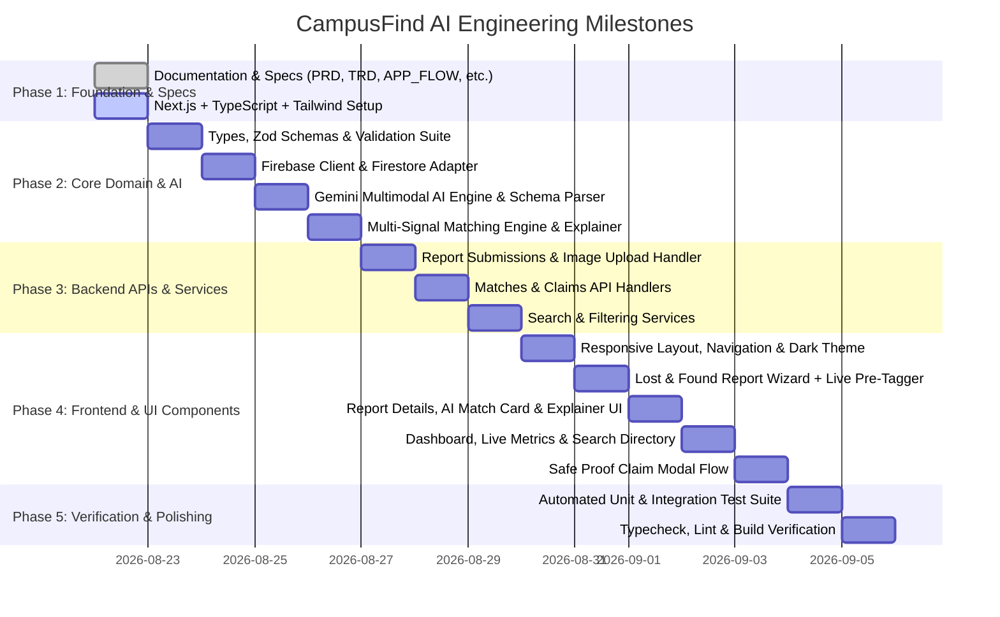

# Implementation & Engineering Roadmap

## CampusFind AI — Smart Campus Lost & Found

- **Document Version:** 1.0.0
- **Path:** `/docs/IMPLEMENTATION_PLAN.md`
- **Status:** Active Architectural Source of Truth

---

# 1. Implementation Philosophy & Hackathon Rules

### Strict Adherence Principles:
1. **Rule 1 — Inspect Before Modifying:** Check existing repository structure and dependencies prior to modifying.
2. **Rule 2 — No Unnecessary Rewrites:** Incremental, robust modular architecture.
3. **Rule 3 — No Placeholder Core Features:** Real multimodal AI extraction, deterministic candidate retrieval, multi-signal scoring without hardcoded numbers, and live Firestore updates.
4. **Rule 4 — No Secret Exposure:** Server-only credentials, zero private keys in client bundles, `.env.example` templates.
5. **Rule 5 — No Random Dependencies:** Lean, high-impact stack (`Next.js`, `TypeScript`, `Tailwind CSS`, `Lucide`, `@google/genai`, `Firebase`, `Zod`, `Vitest`).
6. **Rule 6 — Continuous Verification:** Typecheck, lint, and unit testing after every implementation phase.

---

# 2. Phased Engineering Execution Roadmap

---

# 3. Phase-by-Phase Technical Specifications

## Phase 1: Foundation & Scaffold
- Initialize Next.js 14+ App Router project with TypeScript and strict mode.
- Setup Tailwind CSS with dark-first theme tokens (charcoal surfaces, electric indigo primary, emerald/amber/red status colors).
- Configure `.env.example` and `.gitignore` to prevent any credential exposure.
- Configure Vitest test runner.

## Phase 2: Domain Modeling & Core Engines
- **Data Types (`src/types/index.ts`):** Complete interfaces for `User`, `Report`, `AIRawAttributes`, `MatchDocument`, `MatchScores`, `ClaimDocument`.
- **Validation (`src/lib/validations/`):** Zod schemas for Lost/Found reports, search parameters, and claim proofs.
- **Firebase Adapter (`src/lib/firebase/`):** Universal client & server Firestore operations, query helpers, and storage upload helpers with hybrid local fallback support for instant testing.
- **Gemini Multimodal AI Engine (`src/lib/ai/`):**
  - Uses `@google/genai`.
  - Multimodal vision + text prompt to extract structured JSON: `objectType`, `category`, `brand`, `dominantColor`, `attributes`, `keywords`, `summary`.
  - Resilient parser with error handling and fallback heuristic extractor.
- **Multi-Signal Matching Engine (`src/lib/matching/`):**
  - **Visual Similarity ($w=0.40$):** Image and attribute overlap comparison.
  - **Semantic Similarity ($w=0.25$):** Description & keywords text overlap.
  - **Location Proximity ($w=0.20$):** Campus zone & building coordinate proximity.
  - **Temporal Consistency ($w=0.10$):** Chronological validity window.
  - **Category Match ($w=0.05$):** Exact vs compatible classification.
  - **Rationale Explainer:** Generates transparent, human-readable evidence strings.

## Phase 3: Next.js Route Handlers & Server Services
- `POST /api/reports`: Validate input, save report, trigger AI multimodal analysis, update document with AI attributes, compute matches against opposite active reports.
- `GET /api/reports`: Paginated, multi-filter search (type, category, location, date, keyword).
- `GET /api/reports/[id]`: Retrieve single report details.
- `GET /api/reports/[id]/matches`: Retrieve ranked match candidates with 5-signal scores and generated justifications.
- `POST /api/claims`: Create secure proof-of-ownership claim.
- `GET /api/dashboard/stats`: Compute real-time dashboard metrics from active reports.

## Phase 4: UI/UX Component Implementation
- **Design System & Layout:** `Navbar`, `Footer`, `ThemeWrapper`, accessible `Button`, `Input`, `Dialog`, `Badge`, `Card`, `SkeletonLoader`.
- **Report Submission Wizard:** Dedicated `/report/lost` and `/report/found` forms with drag-and-drop photo upload, instant preview, category/location picker, and Zod client validation.
- **AI Match Cards & Breakdown:** Visual comparison view, color-coded confidence badges, multi-signal meters, and *"Why this matches"* evidence cards.
- **Search & Discovery Page (`/reports`):** Interactive query bar, faceted filters, active tag filters, and grid results with responsive density.
- **Dashboard (`/dashboard`):** Real-time metrics counters, "My Reports" tabbed lists, active match alerts, and quick actions.
- **Safe Recovery Modal:** Proof-of-ownership question prompt and secure claim submission.

## Phase 5: Testing, Hardening & Verification
- Run Vitest unit tests covering:
  - Zod validation and edge cases.
  - Multi-signal matching weight formulas and spatial/temporal calculations.
  - AI JSON parsing resilience and fallback handling.
- Run `npm run typecheck` and `npm run build` to verify production buildability.
- Perform end-to-end smoke test validating the complete user journey.
